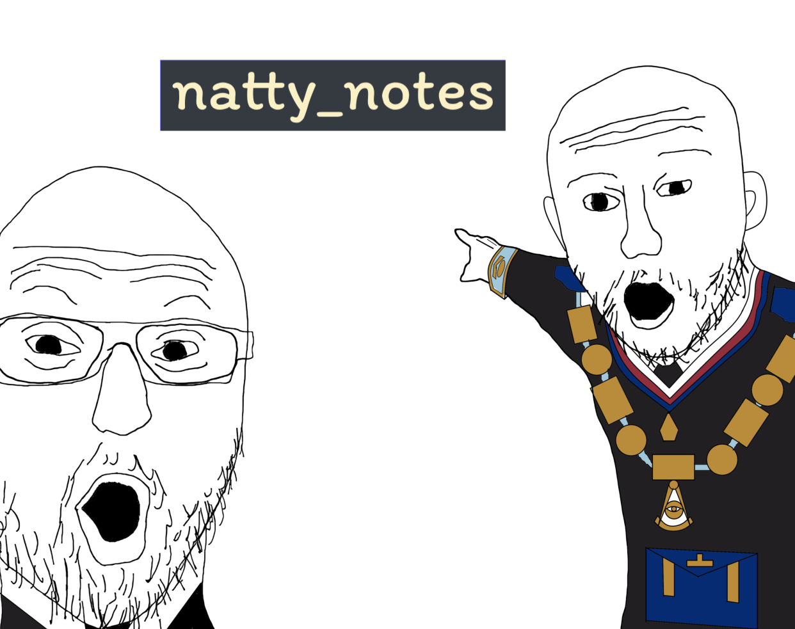

# 📒 natty_notes



This is a simple **CRUD Notes Application** built with **Flask, Flask-Login, and PostgreSQL**. The application allows users to create, read, update, and delete notes securely with authentication.

The project also includes **CI/CD integration** using **GitHub Actions** to run automated tests and ensure smooth deployment. The application is fully containerized using **Docker and Docker Compose** for easy deployment.

---

## 🚀 Features

✅ User Authentication (Register, Login, Logout)  
✅ Create, Read, Update, and Delete (CRUD) Notes  
✅ PostgreSQL Database Integration  
✅ Fully Containerized with Docker  
✅ Automated Testing and CI/CD with GitHub Actions  

---

## 🛠 Technologies Used

- **Flask** - Web framework
- **Flask-Login** - Authentication handling
- **PostgreSQL** - Database
- **Docker & Docker Compose** - Containerization
- **GitHub Actions** - CI/CD Pipeline
- **pytest** - Unit testing

---

## 🔧 Setup & Installation

### **1️⃣ Clone the Repository**

```bash
 git clone --depth=1 https://github.com/ayusjayaswal/teamweb.git
 cd teamweb
```

### **2 Running the Application with Docker**

#### **Build and Start Containers**

```bash
 docker-compose up --build
```

#### **Stop Containers**

```bash
 docker-compose down
```

The app will be accessible at [**http://127.0.0.1:5000/**](http://127.0.0.1:5000/).

---

## 🔄 CI/CD Pipeline

The GitHub Actions workflow includes:

1. **Check for Errors** - Runs `pylint` to catch potential issues.
2. **Run Tests** - Executes `pytest` inside the Docker container.
3. **Docker Build Check** - Ensures the application builds correctly inside a Docker container.

Every **push** and **pull request** to the `main` branch will trigger this workflow automatically.

---
